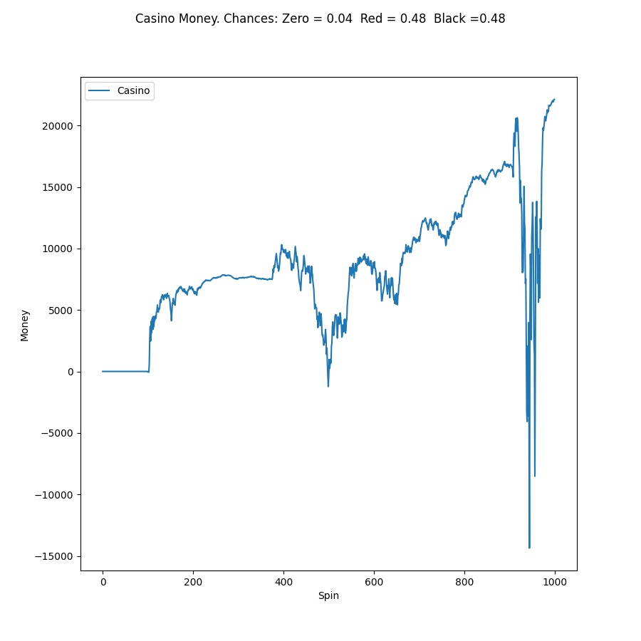
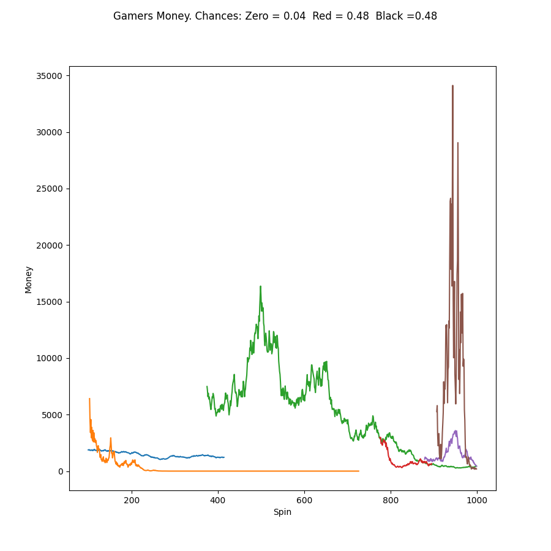
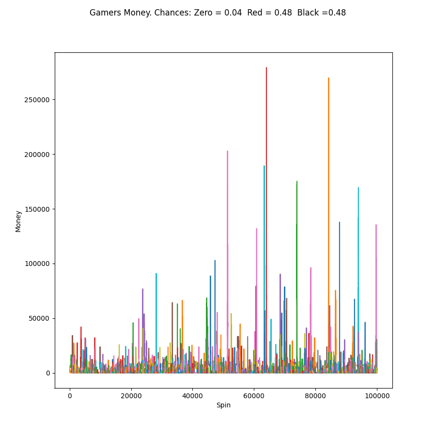
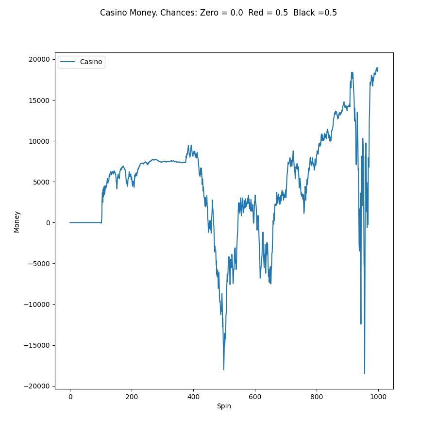
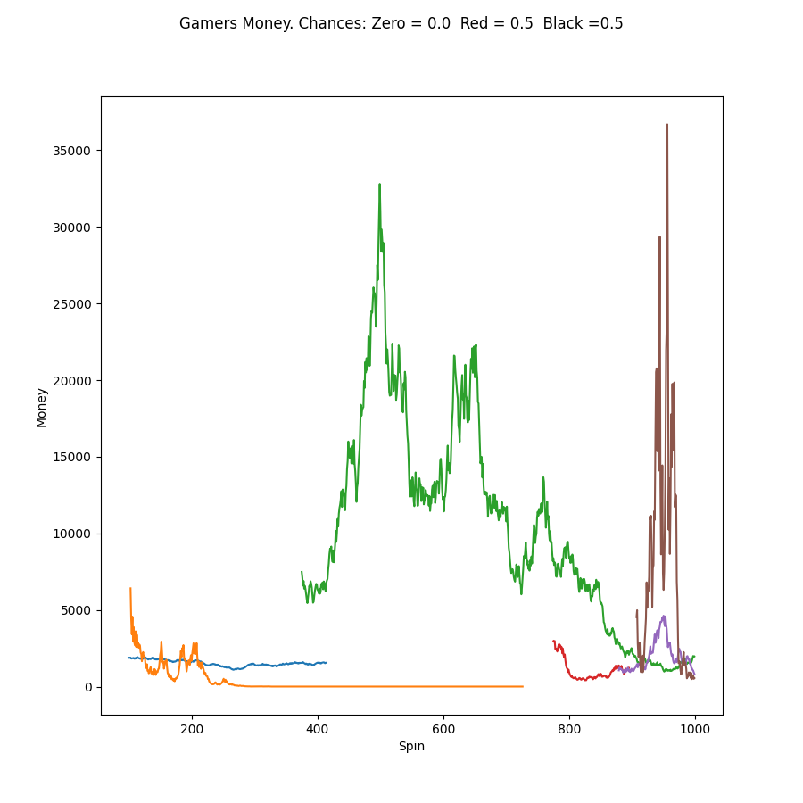
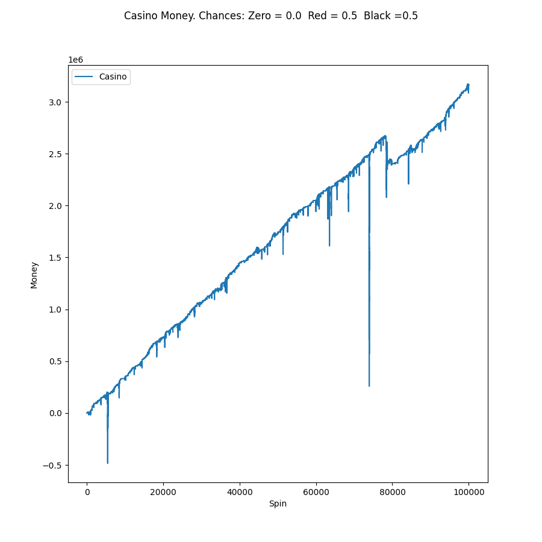
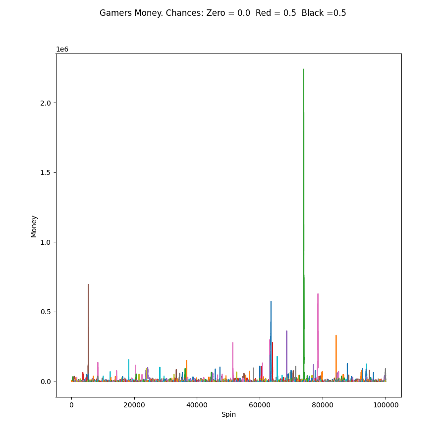

Казино с разными параметрами рулетки <br>
```
roulette_zero_chance = 0.00
roulette_red_chance = 0.5
roulette_black_chance = 0.5
```
Рулетка делает <b>work_time</b> вращений <br>
Во время очередного вращения может появиться игрок с вероятностью <b>new_customer_probability</b>. <br>
Игрок приносит с собой какой-то случайное количество денег и хочет сделать какое-то заранее определенное количество ставок на рулетке.  <br> 
Также игрок имеет параметр <b>risk</b>, что определяет максимальный размер ставки. От 0 до 1. В размере от текущего количества денег.
```
self.bet_money = round(random.random() * self.risk * self.money)
```

### 1000 вращений рулетки. Шанс зеро 4%


### 100000 вращений рулетки. Шанс зеро 4%


### 1000 вращений рулетки. Шанс зеро 0%


### 100000 вращений рулетки. Шанс зеро 0%

